# 13UTOPiA — Brand Experience Report

**Prepared:** 13 August 2026  
**For:** Leadership review  
**From:** The website / brand-experience working team  
**Status:** Strategy, visual direction, and art-direction complete. Production homepage not started on purpose.

This is the document to send upstairs. It is the full picture: what you asked for, what we researched, what we decided, what we generated, what we already have in the product, how closely we followed your brief, and what should happen next.

---

## 0. In one page

**You asked us** not to start by designing screens. You asked us to turn 13UTOPiA into a **category of company**, not another “digital agency + software development” website. You asked us to use **Be Unreal. Be Unreasonable.** as the philosophy of the whole site, not as a slogan under a logo. You asked us to steal *principles* from Munich, RPA, KOTA and Made With GSAP — never copy them.

**We did that first.** We did not jump to Figma or rebuild the live homepage as a pretty template.

**Where we are now**

| | |
|--|--|
| Positioning | Locked in writing |
| Information architecture | Locked in writing |
| Visual direction | Locked: FUTURE as the everyday world, RAW as the first hit, ART as the silence between chapters |
| Design system | Written (type, colour, 13 forms, grid, seven motions, mobile, SEO) |
| Homepage story | Written chapter by chapter |
| Art direction | 18 stills generated — mood frames, not website screenshots |
| Live website code | Exists from earlier work. **Parked.** It is not this new brief. |

**What we need from you**

1. Confirm this direction (or mark what to change).  
2. Confirm four open facts we refused to invent: category name, Canada, “Why 13UTOPiA”, real case/people media.  
3. Say **build** when you want the real homepage in code.

**The standard we are holding** (your words):

> In 5–10 seconds someone should understand: *13UTOPiA is not another agency. These people think differently, they can actually build what they imagine, and they can help me grow it.*

---

## 1. What you asked for — in plain language

You gave a long, precise brief. The heart of it is this:

### The danger
If we list every service equally — branding, CGI, SEO, SaaS, AI, cloud, CTO advisory — a visitor will think:

> “13UTOPiA does everything.”

That is exactly what you said we **must not** let them think.

### The job
Communicate this instead:

> **13UTOPiA is a multidisciplinary company that combines imagination, technology and growth to build what conventional companies cannot.**

### The philosophy
**BE UNREAL. BE UNREASONABLE.**

- **Unreal** = imagination, creativity, ambition, possibility.  
- **Unreasonable** = challenge assumptions, ambitious engineering, refuse mediocre outcomes.  
- Invisible third law (from your DNA): **make it work.** We are not an art experiment. We build brands, products, technology and growth systems for real businesses.

### The tension the website must hold
**WOW** (creative, strange, memorable) **and TRUST** (intelligent, precise, commercially mature) at the same time.

A CEO must never wonder: *can these people actually build my SaaS, fix my technology, grow my company, or deliver an enterprise project?*

### What you told us not to do
- Do not start by making it “look impressive.” Make the **idea** impressive first.  
- Do not position as a digital / branding / marketing / software agency.  
- Do not copy Munich, RPA, KOTA, or GSAP showcases. Steal the job they do.  
- Do not design pages before the system.  
- Do not animate everything.  
- Do not promise “ranked 1st everywhere.”  
- Do not invent a Canada story or a “why us” line that is not true.

We treated every one of those as law.

---

## 2. How we worked (why, when, where)

**When:** 13 August 2026 — one concentrated strategy day after you reset the brief (“forget what we did till now; listen to this”).

**Where:** This lives in the 13UTOPiA project, under `docs/strategy/` and `docs/strategy/boards/`. The public site remains `13utopia.com`. Operating fact today: **India, Iconic Shyamal, Ahmedabad.** Canada is not on the homepage until you say the operating model is real.

**Why we did not code the new homepage yet**  
Your own build order:

1. Brand strategy  
2. Information architecture  
3. Visual direction  
4. **Homepage**  
5. Core pages  
6. SEO / content  
7. Engineering  
8. Launch + growth  

We are at the end of **step 3**, with step 4 fully *specified* and *art-directed*. Starting step 4 in code without your sign-off would have been the old mistake: making a beautiful website before the idea was agreed.

**How we treated the brief**
- Followed it in detail — not a summary, not a remix.  
- If we had a better idea, we labelled it a **suggestion**. The brief still won until you chose.  
- You chose the visual combination (FUTURE + RAW + ART). That is now locked.  
- We started fresh. The previous homepage UI lock is parked.

---

## 3. What we researched

You named four references. We did not pick a favourite site to clone. We took **one job** from each:

| Reference | What it is good at | What we took | What we refused |
|-----------|--------------------|--------------|-----------------|
| **[Munich](https://munich.qodeinteractive.com/)** | Outlined graphics, line-art, graphic systems | Outlines as a *language* that can draw and change | Their shapes, theme-kit look, any copy-paste asset |
| **[RPA Comunicación](https://rpacomunicacion.com/)** | Energy, intro sequence, oversized words, scroll as a story | Sequencing. Type as an event. “They said don’t / too big / too risky…” as a *principle* | Party-site chaos, copying their scroll |
| **[KOTA](https://kota.co.uk/)** | Restraint, editorial type, commercial storytelling, results | Silence between crazy chapters. Case stories as “what changed,” not a pretty grid | Their curves, their layout, their voice |
| **[Made With GSAP](https://madewithgsap.com/)** | Motion as the experience, not decoration | Motion that *means* something. A small set of verbs | A carnival of fade-ins, parallax, and libraries |

**The line we wrote from that research (your DNA):**

> Unreal visuals. Unreasonable interactions. Serious business results.

That third sentence is the one that keeps this from becoming a Dribbble experiment.

---

## 4. The idea we locked

### 13UTOPiA
**BE UNREAL.  
BE UNREASONABLE.**

**A creative technology and growth company building brands, products and systems for ambitious organizations.**

(Exact category name can still get more ownable later. We did not pretend we had invented a cleverer label.)

### Three worlds — what we do
Your six operational capabilities are excellent for running the company. They are **too many** as equal ideas on a website. We grouped them the way you asked:

| World | Holds |
|-------|--------|
| **CREATE** | Brand, identity, creative direction, brand experience, UI/UX, CGI, motion, visual content |
| **BUILD** | Web, apps, SaaS, AI agents, automation, custom software, cloud, DevOps, APIs, product engineering |
| **GROW** | SEO, performance, social, content, leads, growth strategy, digital transformation, CTO advisory |

A branding client and an AI/SaaS client both find themselves in **one beat**.

### Six outcomes — what we solve
You were right: clients do not wake up needing “AI agents + DevOps + SEO + UI/UX.” They wake up needing to:

**Launch · Grow · Scale · Modernize · Automate · Transform**

That becomes a primary storytelling engine, not a footer.

### Names we kept (your names)
- **Perspective** — not About Us  
- **Case Stories** — not Portfolio (“what we changed,” not “what we made”)  
- **Collective** — not Team  

### Navigation (simplified, as you asked)
**Work · Capabilities · Solutions · Perspective · Collective · Connect**  
Persistent: **Start something unreasonable →**  
Practical: **Schedule a discovery call**  
Final: **Let’s make it real.**

Not “Contact us” on every button.

### Homepage job
Not the sitemap.  
**Manifesto + proof + invitation.**

If a block does not do one of those three, it does not belong on Home.

---

## 5. Visual direction — three options, then one law

You asked for three competing directions, then choose one or combine two.

| | RAW | FUTURE | ART |
|--|-----|--------|-----|
| Feel | Dark, distorted type, outlines, aggressive motion | Grid, precision, futuristic form, engineered motion | Paper, crop, organic curve, cinematic quiet |
| 3 seconds | “What the hell is this?” | “Serious.” | “Taste.” |
| 30 seconds | Risk: art school | Highest trust — can ship SaaS | Risk: studio, not builder |
| If it were the *whole* site | Memorable, hard to sell | Safe, may feel like a premium corporate site | Beautiful, weak BUILD signal |

**Why we did not pick only one**  
Your own mix was 40% premium technology · 30% creative studio · 20% editorial · 10% controlled chaos.  
No single board hits all four.

**What we recommended, and what is now locked**

> **FUTURE = the world they live in.**  
> **RAW = the first hit (about 3–8 seconds, then rare).**  
> **ART = the silence between chapters.**

We do **not** average them into one muddy look. Each mode has a job.

Direction stills (language, not pages):

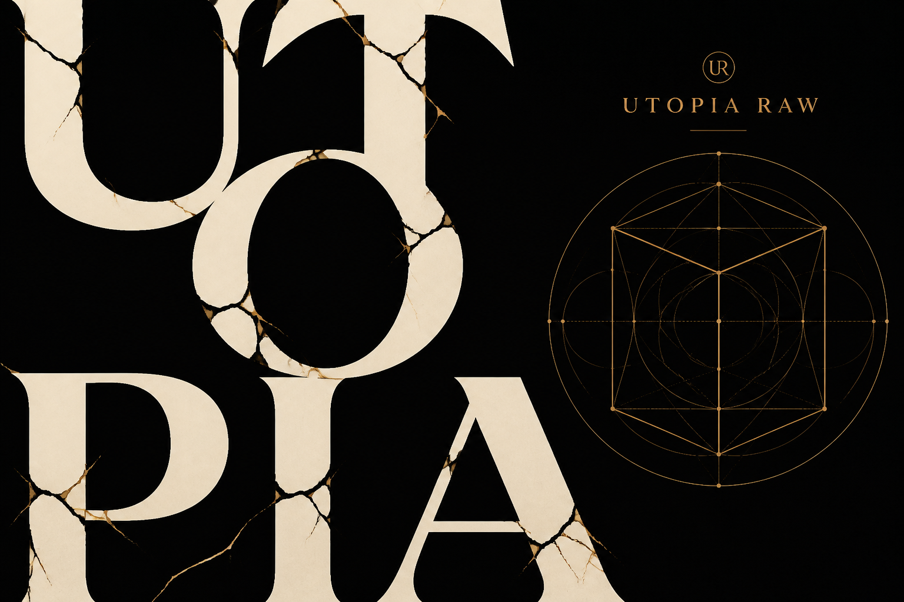

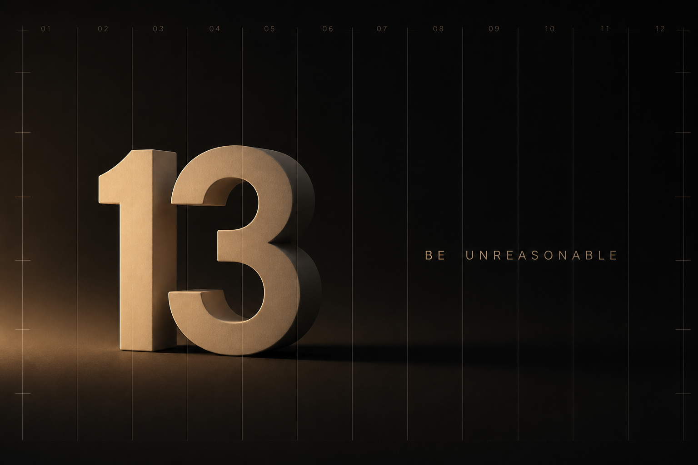

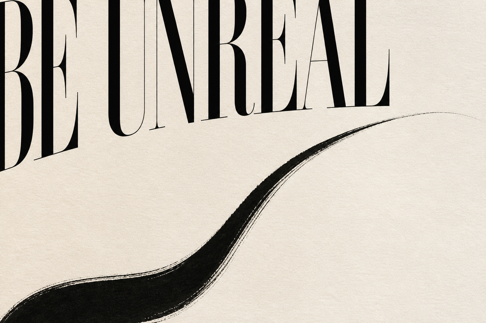

---

## 6. The design system (so the site does not become random)

Written in full in `docs/strategy/DESIGN-SYSTEM.md`. The rules a designer or engineer can actually use:

### Personality
Bold, intelligent, playful, experimental, precise, ambitious.  
The test: **playful + precise.** Only playful = showreel. Only precise = boring corporate.

### Colour (working test — your brief: mostly monochrome + one signature)

You did **not** name a colour. You asked us to test three routes, then pick. Instinct: one unmistakable accent.

What we are testing (not locked as brand law):

| Mode | Field | Accent | Rule |
|------|--------|--------|------|
| FUTURE | Near-black + 12-column grid | Amber as **light** (already in the 3D mark) | Not amber paint on every button |
| RAW | Pure black | One electric outline — *lime was our test, not your brief* | Seconds only. Never a fill. Easy to swap |
| ART | Cream paper | None. Crop is the accent | No second colour |

The existing kit is void / cream / amber light. That feeds FUTURE. Lime is optional RAW ammunition. If you dislike it, RAW can flash white or amber instead. We will not treat lime as the 13UTOPiA brand colour.

### Type (from the kit, still a test)
| Role | Face | Behaviour |
|------|------|-----------|
| Display | Syne | On the grid in FUTURE. Stretched / fractured in RAW |
| Body | Instrument Sans | Always readable. Never warped |
| Editorial | Instrument Serif | ART only — magazine crop |
| Numbers | Instrument Sans | 13 / 07, metrics |

The 3D “13UTOPiA” mark is **custom lettering**. We will not fake it with a Google font.

Sizes: display 120–240px on desktop · body 16–20px · micro 10–13px.  
On mobile: one idea per screen, not 240px shrunk.

### 13 forms (internal — visitors never see the names)
Orbit, Loop, Grid, Wave, Void, Node, Fold, Core, Flow, Frame, Signal, Fragment, Utopia.

They move: idle, cursor, scroll, hover, click. A shape on Home can return, transformed, on an AI page later. That is how the brand is recognised without slapping the logo on every section.

**“13” as mythology — selective.** Load, form IDs, rare `13 / 07`. Not a gimmick on every block.

### Grid
12 columns on desktop. FUTURE lives on it. RAW may ignore it for a few seconds, then **snap** onto it (that snap is the trust moment). ART uses the grid as silence / margins. Breaking the grid is allowed. Staying broken is not.

### Seven motions only
**Morph · Draw · Distort · Reveal · Transform · Break · Reassemble.**

Nothing moves without a reason. No fade-in + slide-up + parallax template.  
Stack: GSAP + ScrollTrigger + SVG + CSS. 3D only when the idea needs it.

### Mobile
Different choreography, not a shrink. Tap instead of cursor. Some decoration dies. The brand stays unreal. It must stay usable.

### SEO (from day one — your correction)
We will not claim “ranked 1st everywhere.”  
We *will* architect: crawlable HTML under the animation, real headings, service URLs only when the page is useful, no thin keyword farms, Organization schema, 13UTOPiA as an **entity**, Core Web Vitals as a design constraint.

*The browser sees a great website. The visitor sees a completely unreasonable website.*

---

## 7. The homepage — chapter by chapter

This is the story someone scrolls. It is specified in `docs/strategy/HOME-BLUEPRINT.md`. Art-direction stills are below. **They are not the website.** They are the look and the feeling, so you can judge before we spend engineering time.

**Rhythm you asked for:** WOW → PROOF → WOW → PROOF → invitation.

**Global / Canada chapter:** skipped on Home until the operating model is a fact. No decorative two flags.

### 00 — Load
13 builds from fragments. Not a percentage spinner.

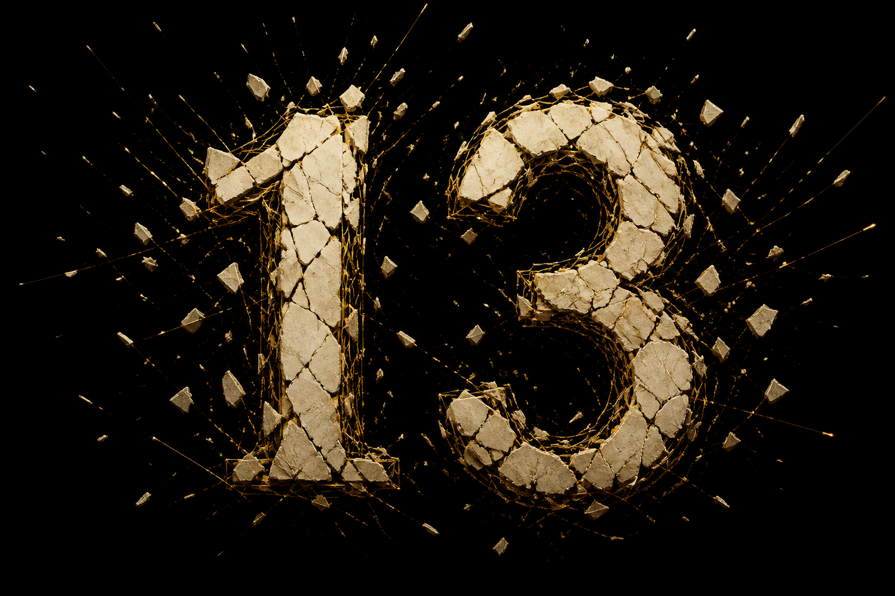

### 01 — Hero (the snap)
**RAW for 3–8 seconds:** type too large, outline mid-morph.  
**Then FUTURE:** the same words sit on the grid. Amber light. Trust.

The motion *between* these two frames is the hero. We will not invent a third layout.

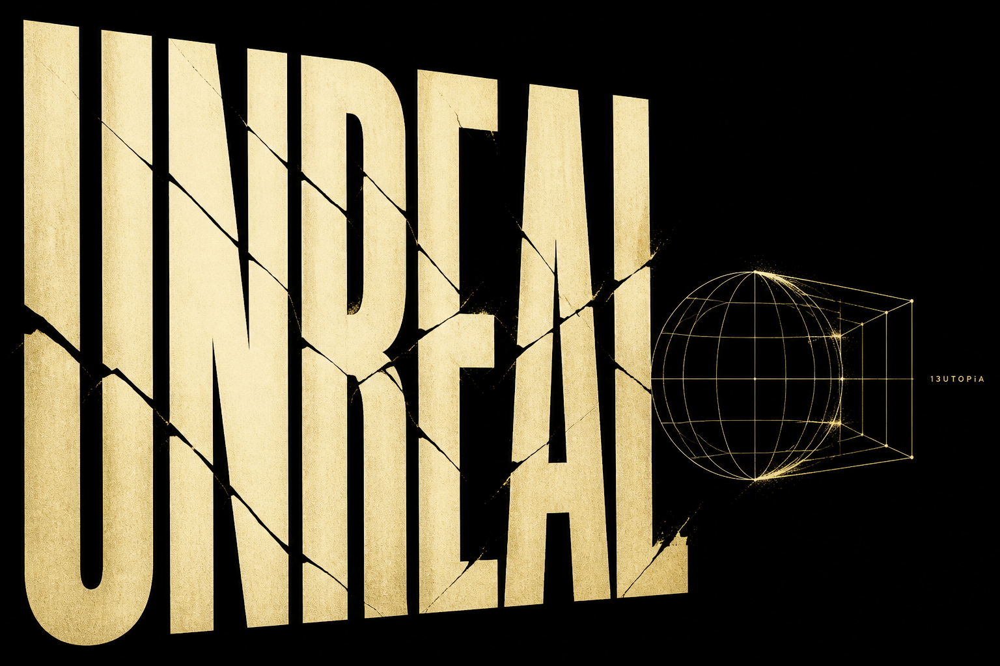

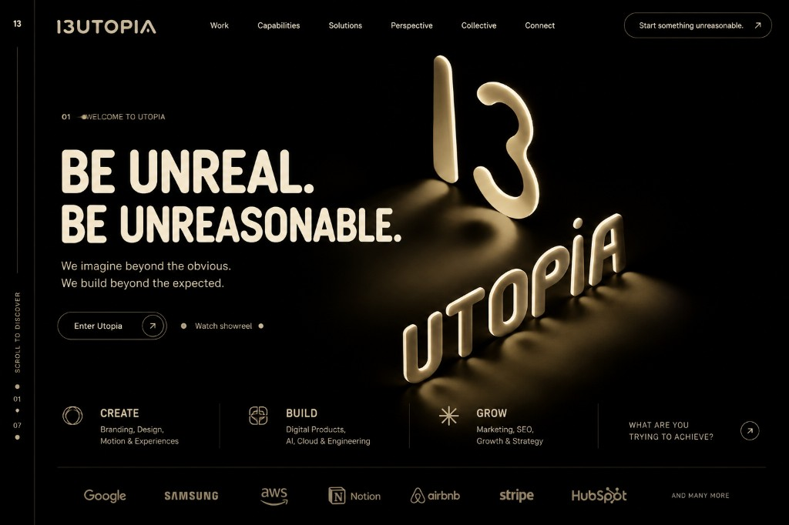

Copy on screen: **BE UNREAL. BE UNREASONABLE.** Then a supporting line (example only until you lock it): *We imagine beyond the obvious. We build beyond the expected.* Then **CREATE · BUILD · GROW.**  
We will **not** open with “13UTOPiA is a creative technology company…”

### 02 — Challenge (silence)
Paper. Your manifesto:

- THE WORLD DOESN’T NEED ANOTHER AGENCY.  
- IT NEEDS PEOPLE WHO SEE WHAT OTHERS DON’T.  
- THAT’S WHY WE EXIST.

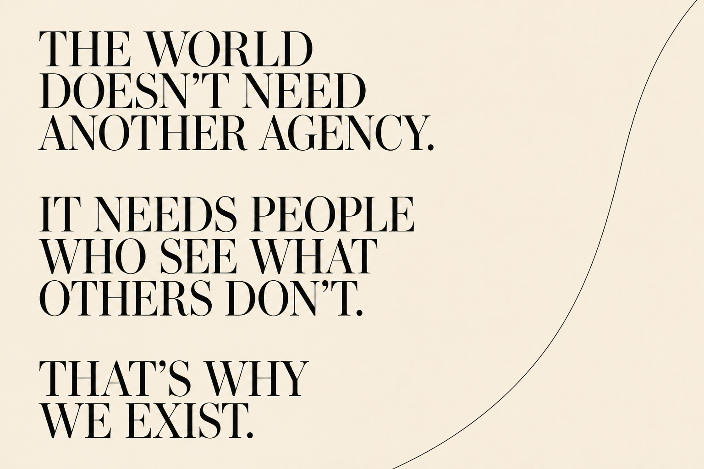

### 03 — What we are (one morph, three states)
WE CREATE / WE BUILD / WE GROW. The form changes. Not six cards.

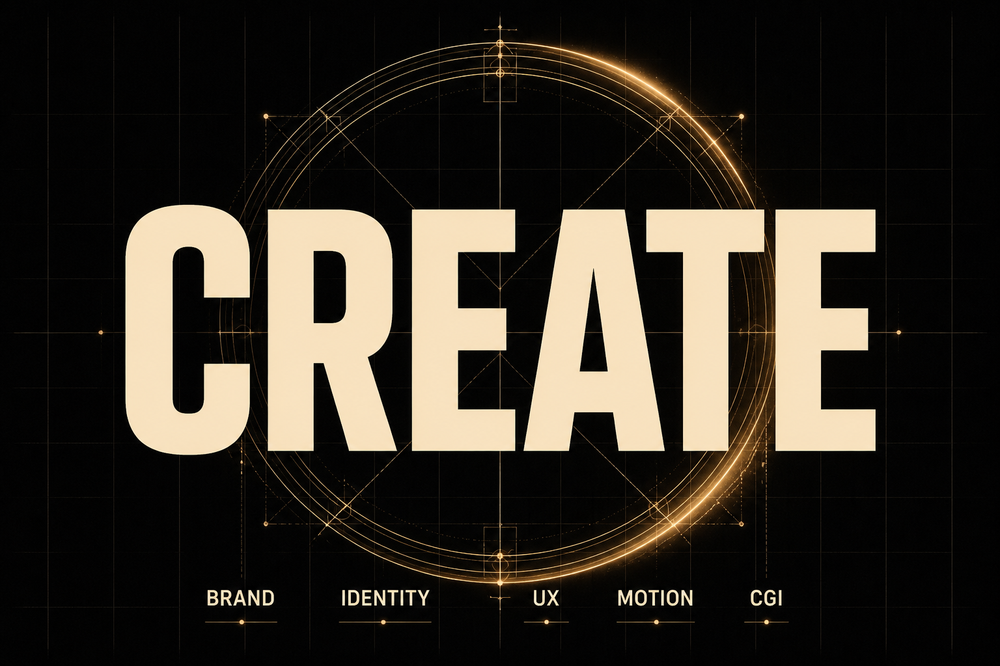

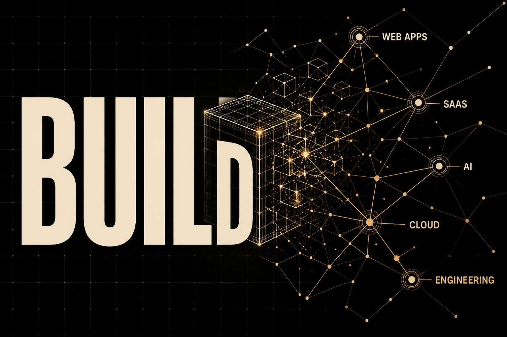

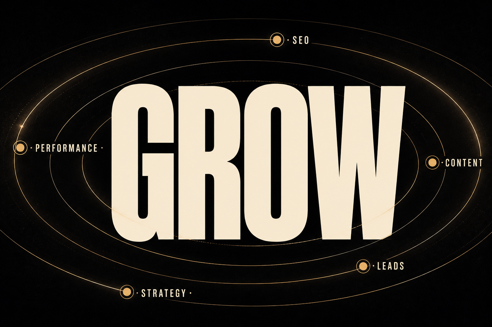

### 04 — What we do (crafts)
Same three worlds, crafts listed underneath, one system. Exploration, not a catalogue of 30 tiles.

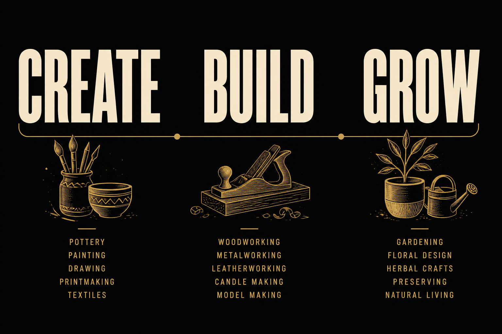

### Device — Normal vs Unreasonable (once on Home)
Your idea, kept:

| Normal | Unreasonable |
|--------|----------------|
| Build a website. | Build a digital ecosystem that changes how the company sells. |
| Run marketing. | Build a growth engine. |
| Use AI. | Rebuild the workflow around AI. |
| Create a brand. | Create a category. |

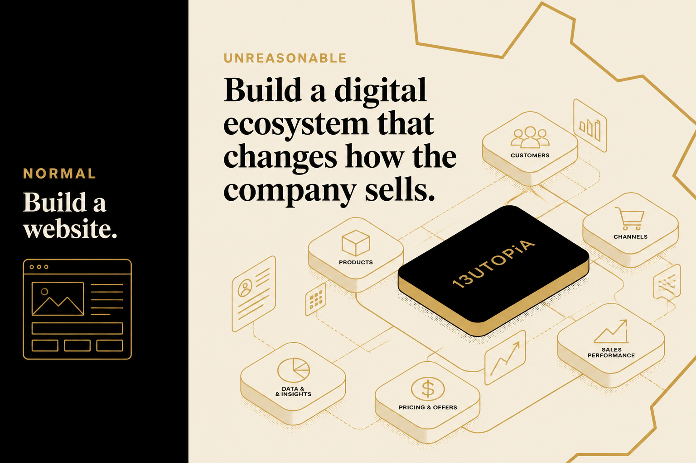

### 05 — What we solve
WHAT ARE YOU TRYING TO DO?  
LAUNCH · GROW · SCALE · MODERNIZE · AUTOMATE · TRANSFORM  

Selecting Automate turns the system into nodes. Grow expands. Modernize breaks a rigid grid and rebuilds it. **Animation communicates the concept.**

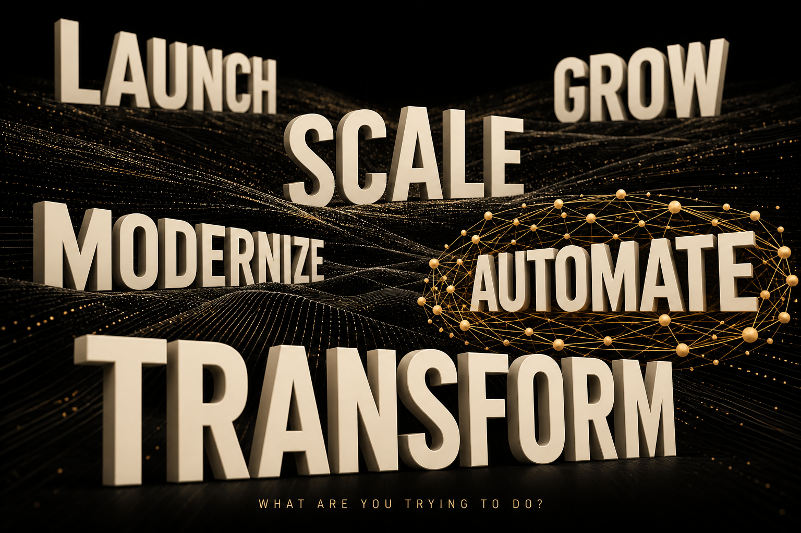

### 06 — Case stories
Not a portfolio grid. Cinematic.  
**The Brief → The Friction → The Unreasonable Idea → The Build → The Result.**  
Placeholders until real work media is locked. We will not invent results.

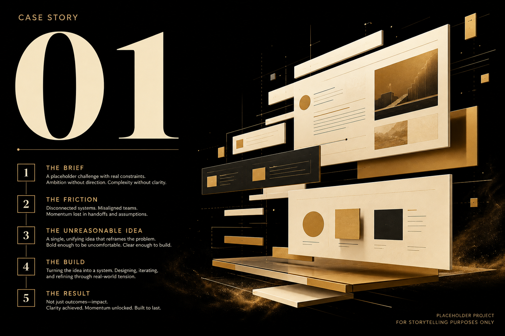

### 07 — Perspective
Story, vision, mission. Editorial. Slow.  
“Why 13UTOPiA” only when the line is true — we did not write passionate-innovation filler.

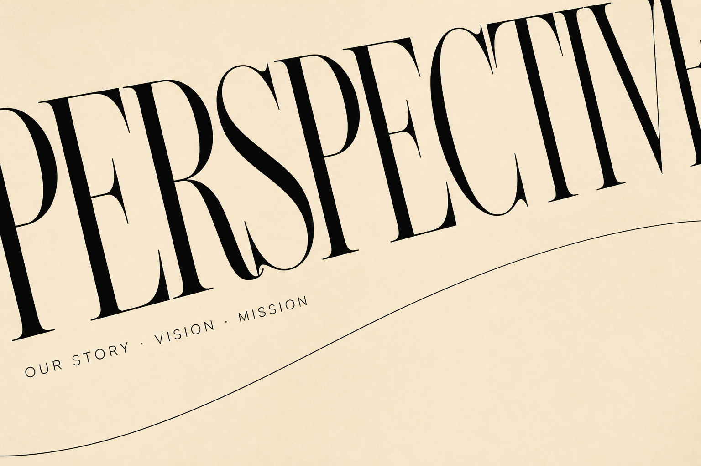

### 08 — Process (your methodology, not the industry cliché)
Not: Discovery → Design → Development → Launch.  
**Question → Imagine → Define → Create → Build → Grow.**

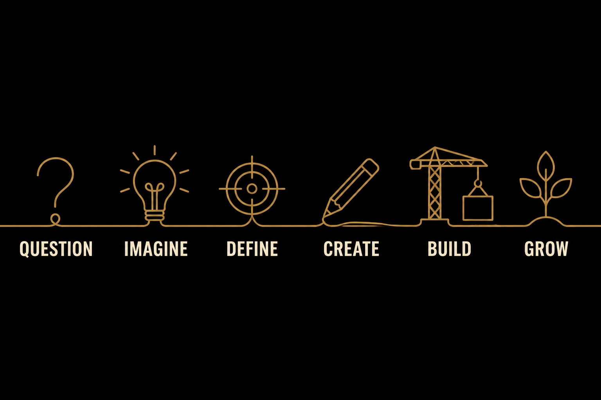

### 09 — Collective
People, not a “team” grid. Strategists, designers, engineers, creators, growth thinkers. Real humans when you give us the pictures. No stock handshakes.

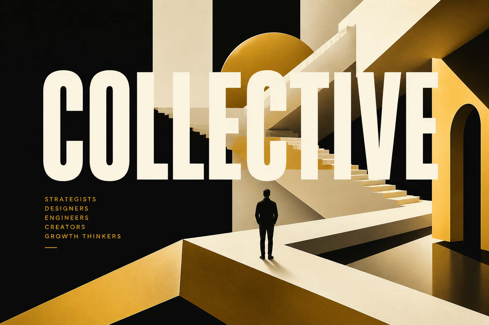

### 11 — Final
**HAVE AN UNREASONABLE IDEA?**  
The visual system collapses into the 13 mark.  
**Let’s make it real.**  
(If a still accidentally drew rounded buttons, those are *not* the system. Buttons on the real site will be on-brand type, not “Contact us.”)

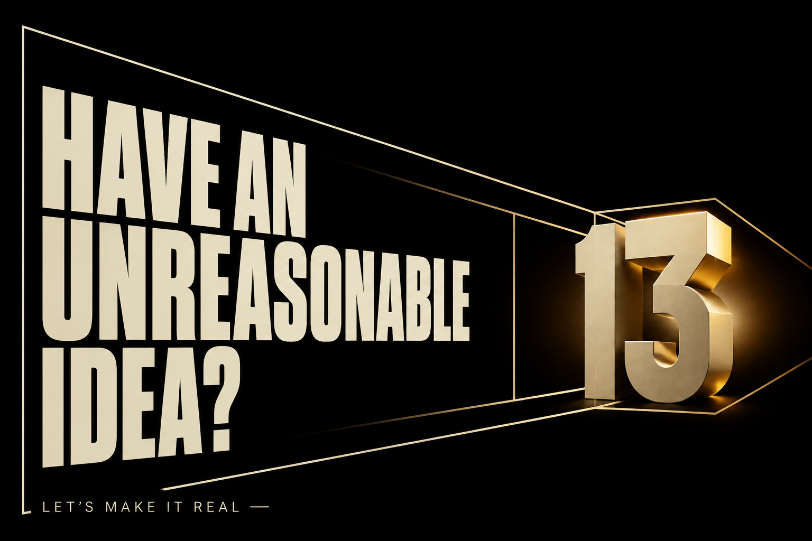

---

## 8. What we already have in the product (honest)

There is a live Next.js site in the repo (App Router, current brand kit: void / cream / amber, Syne + Instrument, Ahmedabad / Shyamal facts, Connect, SEO shell).

**That build is parked for this brief.**  
It was a previous homepage pass. You told us to start fresh from the strategy document. We did. We have **not** dressed the old page up and called it this program.

What *is* real and reusable when you say build:

- Company facts, phone, email, address, social  
- Brand files: flat lockup, 3D wordmark, ghost 13 monogram (`public/brand/`)  
- Technical base: Next.js, performance/analytics hooks, structured data starting point  
- Placeholder rules for case media until logos and project films arrive  

What is **not** this brief: the old “agency homepage” layout, six equal service pillars as the first story, “Contact us” as the only CTA language.

---

## 9. How thoroughly we followed your brief

This is the checklist against **your** document. If a line is “held,” we did not drop it. If a line is “waiting on you,” we refused to invent.

### Part A — Positioning and architecture

| Your point | What we did |
|------------|-------------|
| Two audiences, do not look like “we do everything” | Three worlds + six outcomes. Homepage is not a service dump |
| Use Be Unreal. Be Unreasonable. as philosophy | Operating idea of the whole system, not a caption |
| Do not position as an agency | Working line: creative technology & growth company / collective. Category name still open |
| Six capabilities too many at the top | CREATE / BUILD / GROW; six crafts live underneath |
| Keep Launch / Grow / Scale / Modernize / Automate / Transform | Primary “what we solve” chapter |
| Keep Perspective, Case Stories, Collective | Locked names and jobs |
| Global must feel real | India/Shyamal only until Canada is a fact. No two flags |
| Homepage must not explain everything | Manifesto + proof + invitation. 12 chapters specified, not the full sitemap |
| 40 / 30 / 20 / 10 hybrid | Fuse: FUTURE / RAW / ART assigned to those jobs |
| Design system before pages | System written before any production UI |
| SEO from day one, no rank guarantees | HTML-first rules, useful URLs later, no thin pages |
| Two visitor journeys | “I need to” = Create/Build/Grow. “I want to” = outcomes. Not extra nav items |
| Simplify nav | Six words + one persistent CTA |
| Why 13UTOPiA = real unfair advantages | Investigation list kept. Nothing shipped as copy |
| On-brand CTAs | Start something unreasonable / Let’s make it real / Schedule discovery |
| Unreasonable as a recurring device | Normal vs Unreasonable still + rule: once on Home |
| Build order 1→8 | We stopped before phase 4 code, as instructed |
| 5–10 second standard | Written as the acceptance test for Home |

### Part B — Visual universe

| Your point | What we did |
|------------|-------------|
| Unreal visuals + unreasonable interactions + serious results | Fuse + WOW→PROOF rhythm |
| Visual grammar (outlines, organic interrupt, type as object, transform, break, hidden system) | In the design system |
| Hero as an entering experience | RAW→FUTURE snap specified and still’d |
| Proprietary 13 forms | 13 named, each with a job |
| 13 as selective mythology | Load + rare markers. Not everywhere |
| RPA sequencing | Available; not stacked on top of a long RAW hero |
| Capabilities as morph | CREATE/BUILD/GROW stills |
| Solutions as spatial words | Outcomes still |
| KOTA silence | Challenge + Perspective stills |
| Cinematic case stories | Case still + five-beat structure |
| 5–7 motions | Seven verbs, seven signature sequences |
| SEO under motion | Skeleton H1/H2/links required in the blueprint |
| Performance as a constraint | GSAP + SVG + CSS; no giant hero video |
| Mobile = different dance | Written into the system |
| Final collapse into the mark | Final still + blueprint |
| Wall: remember / meaning / don’t copy / always be useful | Quoted as law |

### Part C — Design DNA

Personality, contradiction, type scale, three colour *routes* (tested as three *modes*), shape physics, chapters, branded process, do-not list — all captured and then **applied** to the fuse rather than left as a mood essay.

### Part D — Three directions
RAW, FUTURE, ART explored with stills. Combined as you allowed. Not one muddy look.

---

## 10. What we refused (this is part of the quality)

We did **not**:

- Start in Figma or rebuild the live homepage to “look impressive”  
- Copy Munich outlines, RPA’s scroll, or KOTA’s site  
- Average three directions into one grey aesthetic  
- Put 15 items in the navigation  
- Write “we are passionate, innovative and customer-focused”  
- Invent a Canada / “global presence” story  
- Invent Why 13UTOPiA  
- Invent case results or team photos  
- Promise #1 rankings  
- Mass-produce SEO pages  
- Treat any electric outline (lime was only a test) as a brand fill  
- Animate everything  

Your brief said the don’t-list is as important as the do-list. We treated it that way.

---

## 11. Decisions that still need you

These are open **because we followed the brief**, not because we forgot them.

1. **Category name** — “Creative technology & growth company” vs “Collective” vs something more ownable.  
2. **Canada** — If it is commercially real, tell us the actual operating split. Then Global can exist. Until then it will not.  
3. **Why 13UTOPiA** — In your words, what is actually true? (One collective / no handoff / strategy through execution — only if that is real.)  
4. **Supporting line under the tagline** — The example is not final.  
5. **Fonts** — Kit faces are the test. If Syne feels generic at 200px, we replace *only* display.  
6. **Real case media and people** — 2–3 days is fine. Placeholders stay until then.  
7. **Colour** — Working test as above. Final hex after you have lived with the stills, not before.

---

## 12. What we recommend next

**Approve this report (or mark amendments).**  
Then say **build**.

That means: implement the homepage in code as a brand experience — semantic HTML underneath, the seven motions on top, mobile as a different dance, placeholders for work and people, no fake Canada, no fake Why.

After Home (your order): Capabilities · Solutions · Case Stories · Perspective · Collective · Connect → then SEO depth → then hardening → then launch.

We are not asking to “make it look like the stills in a template.”  
We are asking to **build the idea you wrote**, now that the idea has a system and a face.

---

## 13. Where every file lives (if someone wants the working papers)

| File | What it is |
|------|------------|
| `docs/strategy/BRIEF.md` | Your brief, filed as the only source of truth |
| `docs/strategy/SUGGESTIONS.md` | Optional improvements (S8 = the fuse, now chosen) |
| `docs/strategy/DESIGN-SYSTEM.md` | Type, colour, forms, motion, nav, mobile, SEO |
| `docs/strategy/HOME-BLUEPRINT.md` | Homepage chapters: what appears, what moves, what copy must do |
| `docs/strategy/DIRECTIONS.md` | RAW / FUTURE / ART |
| `docs/strategy/CHAPTER-STILLS.md` | Index of every still |
| `docs/strategy/boards/` | All generated stills (01–03 directions, 10–24 chapters) |
| `docs/13UTOPiA-BRAND-EXPERIENCE-REPORT.md` | **This document — the one to send** |

---

## 14. Closing

You asked us not to start by designing screens.  
You asked us to make the **idea of 13UTOPiA** impressive, then let design be the visual expression of that idea.

That is what this pack is.

The company is no longer “a digital agency that also does software.”  
On paper — and in pictures — it is a **creative technology and growth company** that can imagine without limits, build without compromise, and grow without convention… and still look like it can ship.

When you are ready, we build it for real.

—

**13UTOPiA**  
Be Unreal. Be Unreasonable.  
But always be useful.
